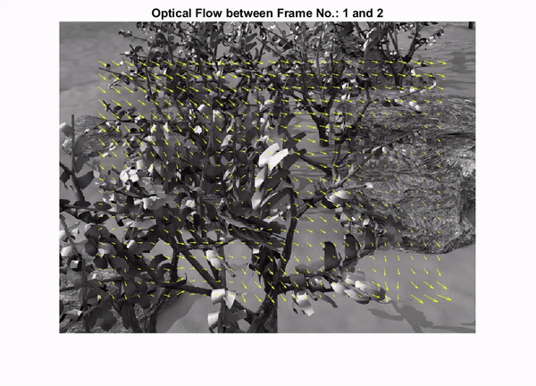

# Optical-Flow

This repository explains shows the basic implementation of 3 optical flow methods: 
      1. Lucas-Kanade Method
      2. Horn-Schunck Method
      3. Farneback Method
      
Initial algorithms for each method are learnt and implemented by understanding the Matlab tutorials about them and then the output is compared with that of in-built functions implementing these methods. 

Some of the outputs are:

Output of Lucas-Kanade Method:
 
